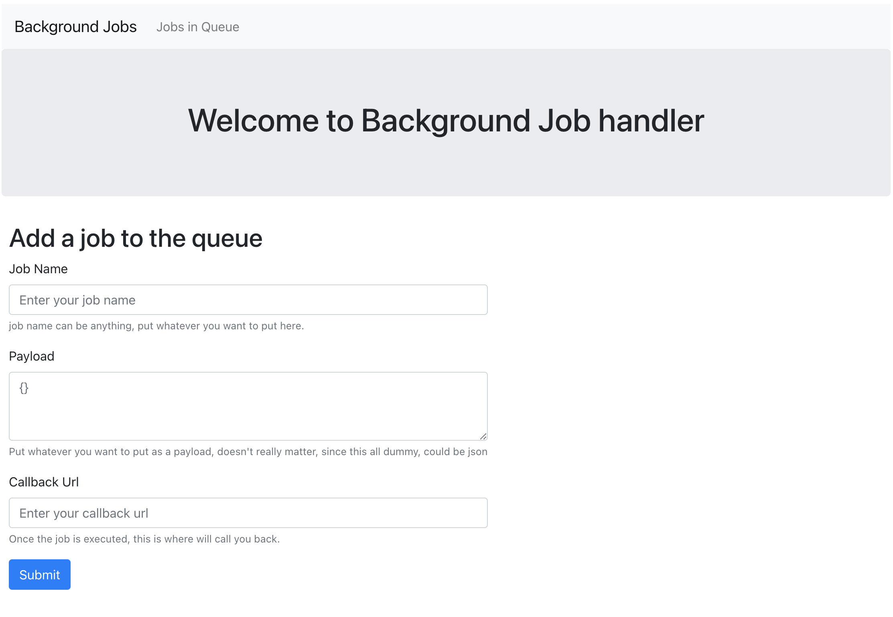
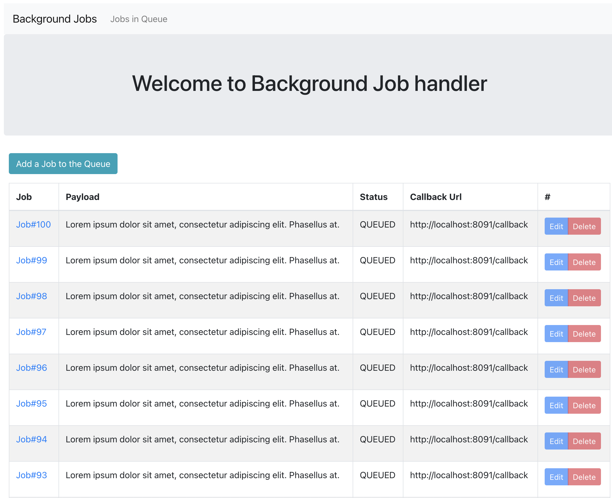

Background Job System
=====================
> https://www.codementor.io/projects/background-job-system-atx32exogo

I have three separate apps,
- **backgroundjob-backend** - receive fake job as and add the queue as requestful api, built using `Java 15`, `spring boot`, `reactive spring`, `h2` database
- **backgroundjob-ui** - react UI to add jobs and display list, built using `reactjs` `redux`
- **fakeServer** - fake server to receive a callback when a job is executed, built using `spring boot`

# Prerequisites:
- Java 15
- node 15
- gradle (the latest one)
- npm 

### Start the backend server:
```
cd backgroundjob-backend
./gradlew bootRun
```

### Start the UI:
```
cd 
npm start
```

### Start FakeServer
```
./gradlew bootRun
```
The above fake server is not required to run, but if you run, you will get a callback with job status.


The backgroundjob-backend will create 100 fake jobs and will keep running. There is a corn job that runs every minutes and
pull 10 jobs from the database that are not completed.
A job can be in one of these four statuses.
- QUEUED
- STARTED
- FAILED
- COMPLETED 

## What do you mean with 'job'?

A job is composed by following fields.
- a job name
- a payload, could be anything, since its all fake
- a callback url, once job is executed, this url will be called

#How add a new job to the Queue 


#Queue List


## TODO
